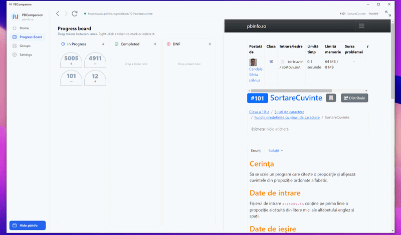
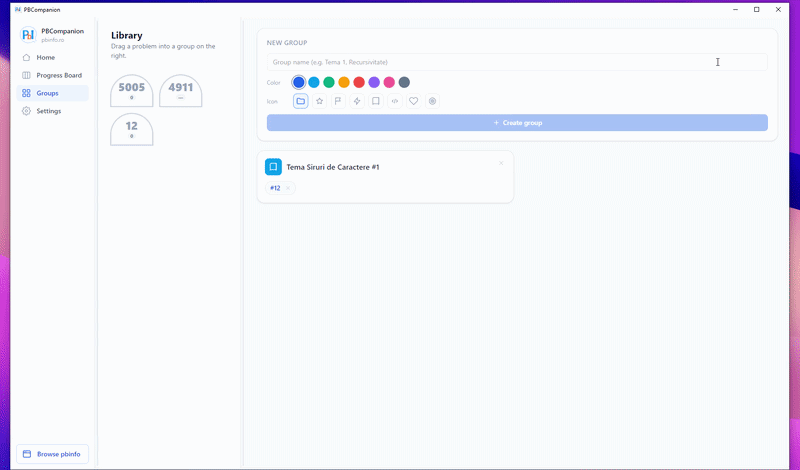

# PBCompanion

**[Romana](#romana)** | **[English](#english)**

Un companion desktop pentru pbinfo.ro / a Windows desktop companion for pbinfo.ro.

---

<a id="romana"></a>

## Romana

Incarca site-ul real [pbinfo.ro](https://www.pbinfo.ro) intr-un browser integrat
si adauga deasupra un strat local de organizare: o tabla de progres cu
drag-and-drop, o biblioteca de probleme, grupuri, notite si tabla de desen per
problema, si istoricul incercarilor.

pbinfo ramane singura sursa de adevar pentru notare. PBCompanion citeste doar
datele tale, de pe pagina pe care o vizualizezi. Nu extrage teste ascunse, nu
automatizeaza trimiteri si nu calculeaza scoruri.

### Navigare si inregistrarea problemelor

Navighezi pe pbinfo in interiorul aplicatiei. Cand deschizi o problema pe care
aplicatia nu a vazut-o inca, apare actiunea NEW; un click o inregistreaza si
aseaza un token pe tabla de progres.


### Tabla de progres

Trei coloane: In Progress, Completed si DNF. Trage tokenii intre si in interiorul
coloanelor; plasarea manuala are mereu prioritate fata de detectarea automata.
Coloanele sunt redimensionabile, iar click-dreapta pe un token iti permite sa-l
marchezi (contur galben) sau sa-l stergi.

### Rezolvare si detectarea scorului

Trimiti solutia pe pbinfo ca de obicei. Scriptul integrat citeste verdictul si
inregistreaza scorul, momentul si codul sursa cand este disponibil. Un scor
maxim muta automat problema in Completed, daca nu ai plasat-o deja tu.



### Notite si tabla de desen

Fiecare problema are notite si o tabla de desen, deschise din fereastra sa de
detalii. Se deschid ca ferestre independente, fara chenar (notitele in stanga,
tabla de desen in dreapta), care pot fi trase oriunde, inclusiv pe alt monitor.
Tabla de desen foloseste un canvas de rezolutie inalta cu trasaturi netede si
continue, o radiera si undo (Ctrl+Z). Ambele se salveaza automat in fiecare
secunda si se inchid odata cu problema.


### Grupuri

Organizezi problemele in grupuri, fiecare cu o culoare si o pictograma, oglindite
ca foldere reale pe disc. Trage problemele din biblioteca intr-un grup;
click-dreapta pe un grup pentru a-l edita.



### Cerinte

- Windows 10 sau 11 (WebView2 este inclus).
- Node.js 18+ si, pentru modulul nativ SQLite, Python si Visual Studio C++ Build Tools.

### Dezvoltare

```
npm install      # instaleaza dependintele si recompileaza better-sqlite3 pentru Electron
npm run dev       # ruleaza cu hot reload
npm run build     # impacheteaza main, preload si renderer in out/
npm start         # ruleaza build-ul impachetat
npm run dist      # creeaza un installer Windows in release/
```

### Date si stocare

- Baza de date: `<dataDir>/pbinfo-organizer.db`
- Foldere grupuri: `<dataDir>/groups/<nume>/`
- Backup sesiune: `<dataDir>/pbinfo-session.bin` (criptat)
- `dataDir` implicit: `%APPDATA%/pbcompanion/pbinfo-data` (se poate schimba in Setari)

Stergerea inregistrarilor locale nu atinge niciodata pbinfo.

---

<a id="english"></a>

## English

It embeds the real [pbinfo.ro](https://www.pbinfo.ro) site in a built-in browser
and adds a local organization layer on top: a drag-and-drop progress board, a
problem library, groups, per-problem notes and whiteboards, and attempt history.

pbinfo remains the single source of truth for grading. PBCompanion reads only
your own data from the page you are viewing. It does not scrape hidden tests,
automate submissions, or compute scores.

### Browsing and registering problems

Browse pbinfo inside the app. When you open a problem the app has not seen yet,
a NEW action appears; clicking it registers the problem and drops a token on the
progress board.


### Progress board

Three lanes: In Progress, Completed, and DNF. Drag tokens between and within
lanes; manual placement always wins over auto-detection. Lanes are resizable,
and right-clicking a token lets you mark it (yellow outline) or delete it.

### Solving and score detection

Submit on pbinfo as usual. The content script reads the verdict and records the
score, timestamp, and source code when available. A full score moves the problem
to Completed automatically, unless you have already placed it yourself.


### Notes and whiteboard

Each problem has notes and a whiteboard, opened from its detail window. They open
as independent, frameless windows (notes on the left, whiteboard on the right)
that can be dragged anywhere, including another monitor. The whiteboard uses a
high-resolution canvas with smoothed, continuous strokes, an eraser, and undo
(Ctrl+Z). Both autosave every second and close with the problem.


### Groups

Organize problems into groups, each with a color and icon and mirrored as a real
folder on disk. Drag problems from the library into a group; right-click a group
to edit it.


### Requirements

- Windows 10 or 11 (WebView2 is included).
- Node.js 18+ and, for the native SQLite module, Python and the Visual Studio C++ Build Tools.

### Development

```
npm install      # installs deps and rebuilds better-sqlite3 for Electron
npm run dev       # run with hot reload
npm run build     # bundle main, preload, and renderer into out/
npm start         # run the bundled build
npm run dist      # build a Windows installer into release/
```

### Data and storage

- Database: `<dataDir>/pbinfo-organizer.db`
- Group folders: `<dataDir>/groups/<name>/`
- Session backup: `<dataDir>/pbinfo-session.bin` (encrypted)
- Default `dataDir`: `%APPDATA%/pbcompanion/pbinfo-data` (changeable in Settings)

Deleting local records never touches pbinfo.

## License

MIT
